# Animated Flow Studio 3.0.1

[English](README.en.md)

Editor de fluxogramas e arquiteturas com tráfego animado em SVG. O pacote descrito neste README inclui 19 componentes de fluxograma, 81 símbolos de System Design, sete protocolos de API, componentes SQL/NoSQL/Schema e um componente Custom com texto e cor reativos ao tráfego.

> Este README descreve o pacote 3.0.1. O editor roda no navegador. Python é opcional para servir os arquivos ou gerar exemplos; Node.js e Playwright são usados no desenvolvimento e nos testes.



## Começar

### Abrir o editor

Extraia o pacote em uma pasta e abra `editor.html` no navegador. Não é necessário instalar dependências para usar o editor.

Para servi-lo por HTTP, abra um terminal na raiz do projeto:

```bash
uv run python3 -m http.server 8000 --bind 127.0.0.1
```

Acesse <http://127.0.0.1:8000/editor.html>. No Windows, se `python3` não estiver disponível, use:

```powershell
uv run python -m http.server 8000 --bind 127.0.0.1
```

Use `Ctrl+C` para encerrar o servidor. Abrir o editor por `file://` e por HTTP pode usar armazenamentos diferentes. O projeto é salvo no navegador; exporte o JSON para manter uma cópia ou transferi-lo para outro navegador.

As fontes locais funcionam offline. O Google Fonts precisa de rede no primeiro carregamento; se a rede falhar, o editor usa uma fonte de reserva e exibe um aviso.

## Exemplos

Os exemplos HTML podem ser abertos diretamente ou pelo servidor local:

| Exemplo | Arquivo ou ação |
| --- | --- |
| Tabelas e componente reativo | [`examples/v3-features.html`](examples/v3-features.html) |
| Sete protocolos de API e tráfego | [`examples/api-7-protocols.html`](examples/api-7-protocols.html) ou o botão **7 protocolos de API** em Modelos |
| Fluxo de IA com Python | [`demo.html`](demo.html) |
| Projeto editável de protocolos | Importe [`examples/api-7-protocols.json`](examples/api-7-protocols.json) |
| Prévia dos protocolos | [`examples/api-7-protocols.png`](examples/api-7-protocols.png) e [`examples/api-7-protocols.svg`](examples/api-7-protocols.svg) |
| Arquitetura de pedidos | Importe [`examples/system-design.json`](examples/system-design.json) |
| Componentes de fluxograma | Importe [`examples/componentes.json`](examples/componentes.json) |
| Catálogo System Design | Importe [`examples/system-design-catalog.json`](examples/system-design-catalog.json) |
| Cores personalizadas | Importe [`examples/cores.json`](examples/cores.json) |

Os arquivos JSON são projetos editáveis; PNGs e SVGs incluídos em `examples/` são prévias. SVGs animados e estáticos exportados pelo editor incluem dados do projeto e podem ser reabertos em **Arquivo → Abrir projeto JSON ou SVG editável**. SVGs comuns, SVGs antigos sem esses dados e SVGs de componente não são projetos importáveis.

Para preservar animações e reações de texto/cor dos protocolos, prefira a exportação HTML: alguns leitores que exibem SVG como imagem bloqueiam seu JavaScript. A exportação PNG registra 300 dpi e limita a imagem a 16 megapixels; diagramas grandes podem exigir redução da resolução. O editor usa 1 rem (16 unidades SVG) como tamanho inicial dos marcadores. Legendas podem ser ajustadas entre 0,1875 e 2 rem, e partículas acompanham o tamanho da legenda. O JSON e a API Python preservam o campo `size` em unidades SVG para compatibilidade com projetos existentes.

Os símbolos de protocolo usam geometria normalizada em um `viewBox` de 16 × 16 e a mesma curva de opacidade dos marcadores de solicitação e resposta: `0 → 0,86 → 0,86 → 0`. As cores do modelo de API são: REST azul, GraphQL rosa, gRPC roxo, WebSockets laranja, Webhooks vermelho, SSE ciano e MQTT verde. Webhooks percorre o conector em loop, com uma breve pausa entre eventos.

## Controles do editor

| Ação | Como fazer |
| --- | --- |
| Inserir componente | Use as bibliotecas Fluxograma, System Design ou Custom |
| Editar texto, fonte, tamanho ou cores | Selecione o componente e use o painel direito |
| Conectar componentes | Arraste uma porta azul até outra porta ou componente |
| Reconectar uma linha | Selecione a linha e arraste uma das pontas |
| Zoom suave | `Ctrl`/`Cmd` + roda do mouse |
| Mover o canvas | Arraste o fundo, use o botão do meio ou `Espaço` + arraste |
| Centralizar o diagrama | Use **Centralizar / Ajustar à tela** |
| Ajustar tráfego e velocidade | Abra uma legenda pelo nome |
| Desfazer/refazer | `Ctrl`/`Cmd` + `Z` / `Ctrl`/`Cmd` + `Shift` + `Z` |
| Guardar o projeto | Exporte o JSON ou o SVG pelo editor |

O guia detalhado está em [`docs/GUIA_DO_EDITOR.md`](docs/GUIA_DO_EDITOR.md).

## Gerar um diagrama com Python

Requer `uv` e Python 3.10 ou superior. O projeto não usa bibliotecas Python em tempo de execução. Para gerar os exemplos incluídos:

```bash
uv run python example.py
```

O comando atualiza `demo.html` e `demo.json`. Abra o HTML no navegador ou importe o JSON no editor.

Exemplo de uso da API Python:

```python
from animated_flow import Diagram, Edge, Legend, Node

flow = Diagram("Cliente e serviço", traffic_speed=1.5)
flow.add_legend(Legend("evento", "Evento", effect="comet", speed=2))
flow.add_node(Node("cliente", "Cliente", 40, 100, type="system", icon="sd:client"))
flow.add_node(
    Node(
        "servico",
        "Aguardando",
        380,
        100,
        type="reactive",
        icon="sd:server",
        typography={"fontSize": 16, "bold": True},
        reactive={
            "enterText": "Recebido",
            "exitText": "Enviando",
            "text": True,
            "color": True,
            "hold": 2,
        },
    )
)
flow.add_edge(Edge("cliente", "servico", traffic=("evento",), connector="curve", route="curve"))
flow.save("meu-fluxo.html")
flow.save_json("meu-fluxo.json")
```

Salve o código em `meu_fluxo.py`, ao lado de `animated_flow.py`, e execute `uv run python meu_fluxo.py`.

## Desenvolvimento e testes

Requer Python 3.10 ou superior e Node.js 20 ou superior. Execute os comandos na raiz do projeto. Instale `uv` pela [documentação oficial](https://docs.astral.sh/uv/getting-started/installation/). `uv sync` cria o ambiente virtual e instala as ferramentas de desenvolvimento, incluindo Ruff; `uv.lock` fixa as versões desse ambiente.

### Build, lint e testes sem navegador

```bash
uv sync
uv run ruff check .
uv run ruff format --check .
uv run python build.py
node --test tests/*.cjs
uv run python3 -m unittest discover -s tests -v
```

### Testes com navegador

```bash
npm ci
npx playwright install chromium
node tests/editor-typography.js
node tests/editor-browser.js
node tests/editor-task.js
```

`node tests/editor-task.js` executa as tarefas 4–11 em sessões isoladas. Para executar uma tarefa específica ou consultar a ajuda:

```bash
node tests/editor-task.js 10
node tests/editor-task.js --all
node tests/editor-task.js --help
```

Atalhos disponíveis: `npm test`, `npm run test:typography`, `npm run test:browser` e `npm run test:tasks`.

A fonte usada nos testes está em `tests/fixtures/DejaVuSans.ttf`, acompanhada de sua licença. Não é necessário instalar fontes no sistema. Opcionalmente, `AFS_TEST_FONT_PATH` seleciona outro arquivo TTF; um caminho inválido gera uma mensagem clara.

No CachyOS, Arch ou WSL, o aviso `OS is not officially supported` indica que o Playwright selecionou uma distribuição alternativa. Se o navegador não iniciar, verifique o erro de inicialização. Também é possível selecionar um Chromium já instalado:

```bash
AFS_BROWSER_PATH="$(command -v chromium)" node tests/editor-browser.js
```

Use esse comando somente se `command -v chromium` retornar um executável. `AFS_BROWSER_PATH` aceita um caminho absoluto para um Chromium compatível. Os testes são headless e não precisam de uma janela gráfica.

Os testes de fontes usam respostas de rede controladas, incluindo bytes de uma fonte real; não verificam a disponibilidade ao vivo do Google Fonts. A validação em Chromium não comprova compatibilidade com todos os sistemas operacionais.

## Arquitetura e estrutura

A arquitetura usa C4, fluxos, ADRs, contratos e SDD. Comece por [`docs/architecture/README.md`](docs/architecture/README.md); decisões ficam em [`docs/adr/`](docs/adr/) e especificações de funcionalidades em [`docs/sdd/`](docs/sdd/). O plano de lançamento está em [`BACKLOG.md`](BACKLOG.md), tarefas em [`TASKS.md`](TASKS.md) e materiais de produto em [`docs/product/`](docs/product/).

| Caminho | Finalidade |
| --- | --- |
| `editor.html` | Editor pronto para abrir no navegador |
| `animated_flow.py`, `example.py` | API e exemplo Python |
| `src/core-engine.js`, `canvas.js`, `icons.js`, `templates.js` | Motor, geometria, ícones e modelos |
| `src/editor-*.js`, `editor.css`, `editor-shell.html` | Interface e controles |
| `src/traffic-runtime.js`, `font-manager.js` | Eventos de tráfego e fontes |
| `src/components/` | Formas SVG parametrizadas e manifesto |
| `assets/flowchart/`, `assets/system-design/`, `assets/custom/` | Arquivos SVG dos componentes |
| `tests/` | Testes unitários e de navegador |
| `examples/` | Projetos de exemplo e prévias exportadas |
| `TASKS.md` | Registro de tarefas |

Para adicionar uma forma SVG, siga [`src/components/README.md`](src/components/README.md) e execute `uv run python build.py`. `src/flow-core.js`, `src/editor.js` e `editor.html` são gerados; altere os módulos de origem.

Para gerar o ZIP de distribuição com o histórico Git:

```bash
uv run python tools/package_release.py
```

O comando requer Git, uma branch ativa e uma árvore de trabalho limpa. O pacote é salvo em `dist/animated-flow-studio.zip`; arquivos ignorados, como `node_modules`, caches e configurações pessoais, não são incluídos.

O ZIP de distribuição inclui o repositório Git completo em `.git/`. Após extrair o pacote, consulte o histórico com:

```bash
git status
git log --oneline
```

Não é necessário executar `git init` nem definir `GIT_DISCOVERY_ACROSS_FILESYSTEM`. Para recuperar o histórico de um pacote antigo que contenha apenas `history.bundle`, execute em uma pasta nova:

```bash
git clone history.bundle ../animated-flow-recuperado
cd ../animated-flow-recuperado
git log --oneline
```

O comando recupera os arquivos commitados no bundle. Copie para a nova pasta eventuais alterações locais que não foram commitadas.

## Limites conhecidos

O editor aceita até 500 componentes, 1.000 conexões e 20 legendas. Tabelas aceitam de 1 a 12 colunas e de 0 a 40 linhas. Importação de `.drawio`, Mermaid e BPMN, auto-conexões e roteamento completo para evitar obstáculos não estão disponíveis.

## Atualizações

O projeto é atualizado regularmente com correções de bugs e otimização de código.

## 📝 Licença e créditos

O projeto está licenciado sob a GNU General Public License v3.0. Consulte [`LICENSE`](LICENSE) para os termos completos.

---

Desenvolvido por Welton Leite 👋 <br/>
[LinkedIn](https://www.linkedin.com/in/welton-leite-b3492985/) · [GitHub](https://github.com/wwwwelton)
