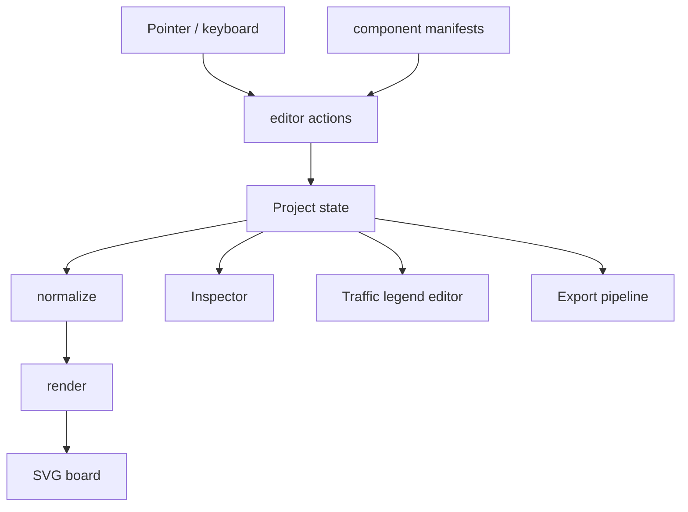

# C4 · Components

## Editor

### Regras de dependência

- `core-engine.js` permanece sem DOM e sem rede.
- UI pode depender do core; core não depende da UI.
- arquivos gerados (`flow-core.js`, `editor.js`, `editor.html`) não são fonte primária de edição.
- componentes SVG entram pelo manifesto e pelo build.
