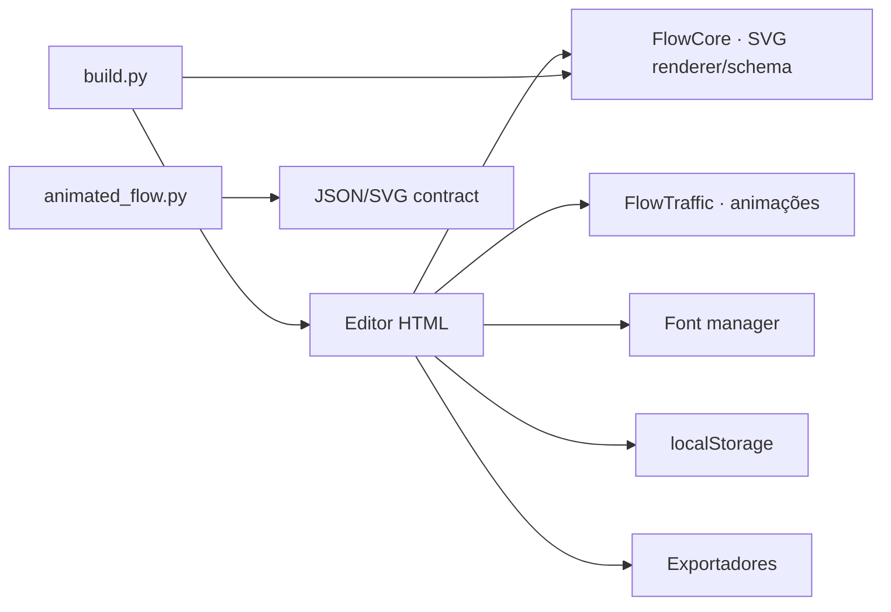

# C4 · Containers

| Container | Responsabilidade |
|---|---|
| `editor.html` | aplicação final autocontida |
| `src/core-engine.js` | schema, geometria e renderização SVG pura |
| `src/editor-*.js` | estado, interação e UI |
| `src/traffic-runtime.js` | execução do tráfego animado |
| `src/font-manager.js` | fontes locais/remotas e embedding |
| `build.py` | compila módulos e manifests nos artefatos finais |
| `animated_flow.py` | API Python opcional para geração programática |
