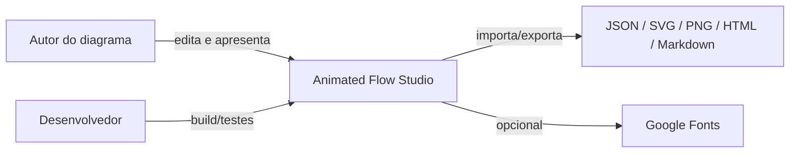

# C4 · System Context

## Objetivo

Animated Flow Studio é um editor local-first para construir diagramas de arquitetura e fluxos com SVG animado, sem exigir backend para uso normal.

### Fronteiras

- O editor funciona offline com os assets empacotados.
- Rede é opcional e usada apenas para fontes externas quando selecionadas.
- Diagramas ficam no navegador até serem exportados pelo usuário.
