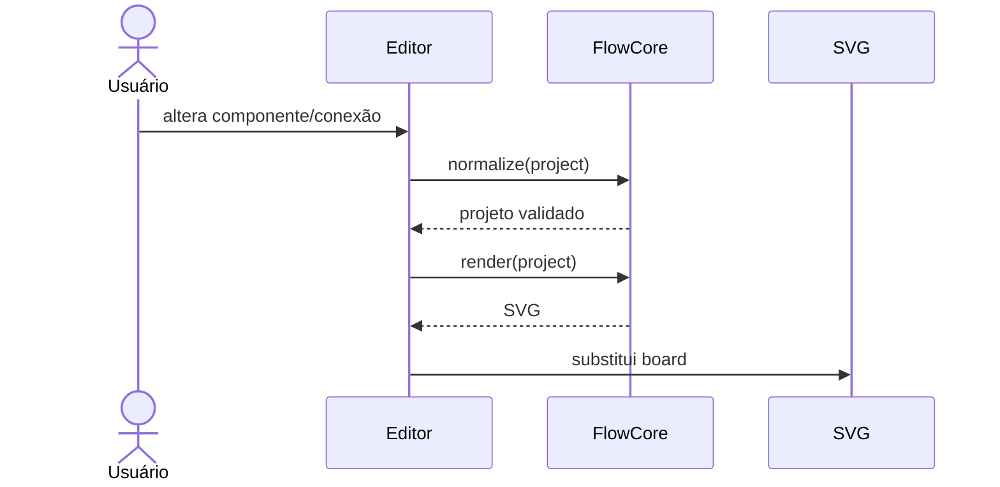

# Runtime View

## Edição e renderização

## Tráfego

Cada legenda define símbolo/efeito, tamanho, velocidade e direção. As conexões referenciam uma ou mais legendas. O renderer produz trilhos e markers; o runtime monta as animações respeitando `prefers-reduced-motion`.
