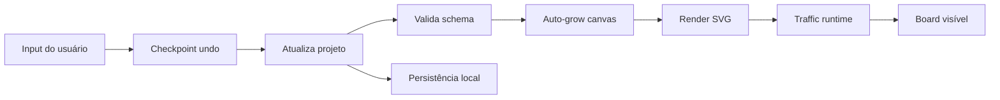

# Flow · Editor runtime

O renderer cria tokens SVG de 16 × 16 unidades (1 rem) por padrão para REST, GraphQL, gRPC,
WebSockets, Webhooks, SSE e MQTT. O runtime posiciona cada token com
`getPointAtLength` no path do próprio conector. A margem do centro do token
inclui metade do tamanho configurado, mais 4 unidades na saída e 8 na chegada,
para preservar a distância dos cards e das pontas de seta. O tamanho editado
na legenda, exibido em rem, determina também o tamanho de cada partícula do protocolo. O JSON guarda `size` em unidades SVG para compatibilidade. Ao mover
cards ou editar conectores, o editor recria
o SVG e o runtime passa a ler o novo path. O relógio do SVG controla pausa e
retomada; com movimento reduzido, fica um indicador parado no meio do path.
Os tokens móveis dos sete protocolos usam a mesma curva de opacidade de
Solicitação e Resposta: entram de 0 a 0,86 nos primeiros 6% do percurso,
mantêm 0,86 até 94% e desaparecem até o fim. Os símbolos da legenda ficam
com opacidade 1.

O Webhook repete o percurso de origem para destino, com uma pausa curta entre
entregas. Para reiniciar o ciclo em um conector, use `FlowTraffic.trigger(svg, edgeId)`;
sem `edgeId`, a chamada reinicia todos os conectores Webhook do diagrama e
preserva o intervalo entre as etapas do fluxo.
As cores iniciais dos sete protocolos seguem a paleta Bootstrap e podem ser
editadas por legenda. No modelo de API, cada trecho começa depois da chegada
ao componente anterior. REST, GraphQL e gRPC fazem a resposta retornar pelo
mesmo caminho após a solicitação alcançar o destino; WebSockets mantém os dois
sentidos simultâneos; SSE e Webhook seguem apenas da origem ao destino.
MQTT aguarda a chegada ao broker antes de iniciar os caminhos para assinantes.
