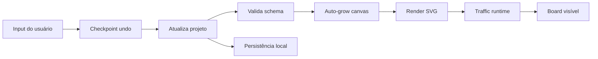

# Flow · Editor runtime

```mermaid
flowchart LR
    Input[Input do usuário] --> Checkpoint[Checkpoint undo]
    Checkpoint --> State[Atualiza projeto]
    State --> Normalize[Valida schema]
    Normalize --> Grow[Auto-grow canvas]
    Grow --> Render[Render SVG]
    Render --> Traffic[Traffic runtime]
    Traffic --> Board[Board visível]
    State --> Persist[Persistência local]
```
