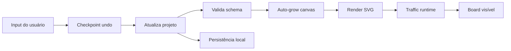

# Flow · Editor runtime

O renderer cria tokens SVG de 14 × 14 unidades por padrão para REST, GraphQL, gRPC,
WebSockets, Webhooks, SSE e MQTT. O runtime posiciona cada token com
`getPointAtLength` no path do próprio conector, mantendo 4 unidades de margem
na saída e 8 na chegada para o tamanho padrão; tokens maiores recebem margem
adicional. O tamanho editado na legenda determina também o tamanho de cada
partícula do protocolo. Ao mover cards ou editar conectores, o editor recria
o SVG e o runtime passa a ler o novo path. O relógio do SVG controla pausa e
retomada; com movimento reduzido, fica um indicador parado no meio do path.

O Webhook executa uma vez ao montar o diagrama. Para disparar outra entrega em
um conector, use `FlowTraffic.trigger(svg, edgeId)`; sem `edgeId`, a chamada
dispara todos os conectores Webhook do diagrama. O fluxo MQTT aguarda a chegada
ao broker antes de iniciar os caminhos de saída para os assinantes.
