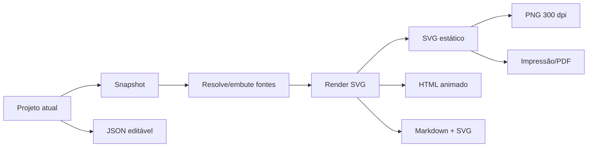

# Flow · Exportação

```mermaid
flowchart LR
    Project[Projeto atual] --> Snapshot[Snapshot]
    Snapshot --> Fonts[Resolve/embute fontes]
    Fonts --> SVG[Render SVG]
    SVG --> Static[SVG estático]
    SVG --> HTML[HTML animado]
    Static --> PNG[PNG 300 dpi]
    Static --> PDF[Impressão/PDF]
    Project --> JSON[JSON editável]
    SVG --> MD[Markdown + SVG]
```
